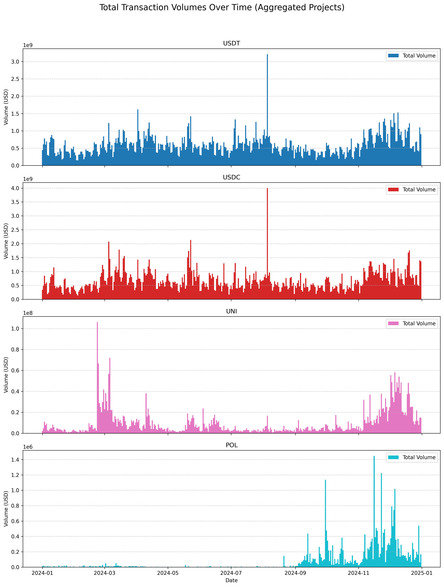
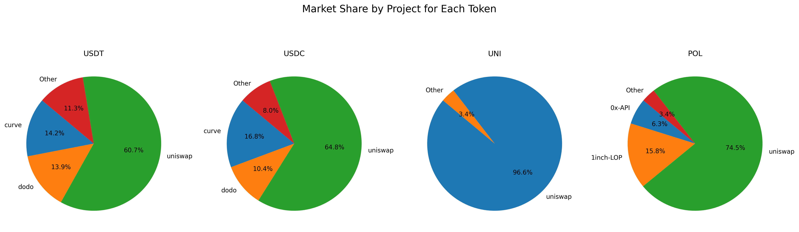
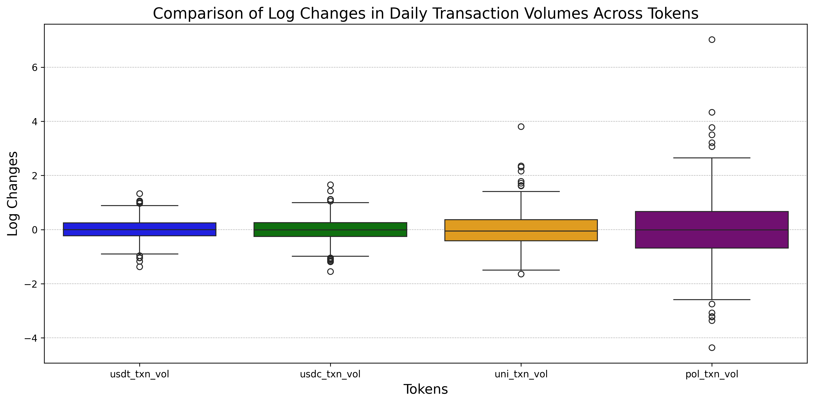
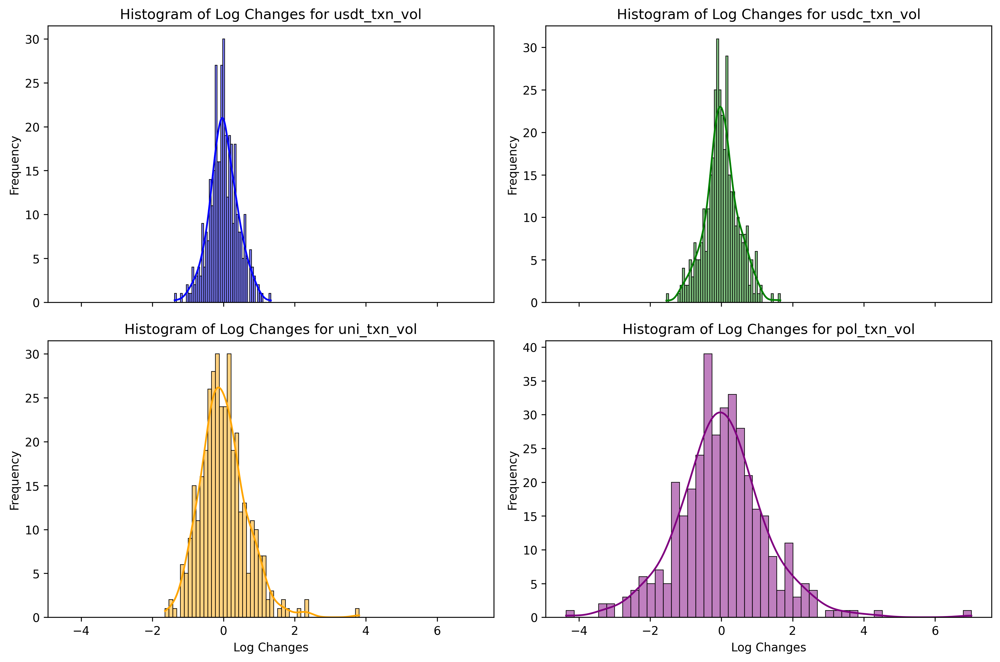
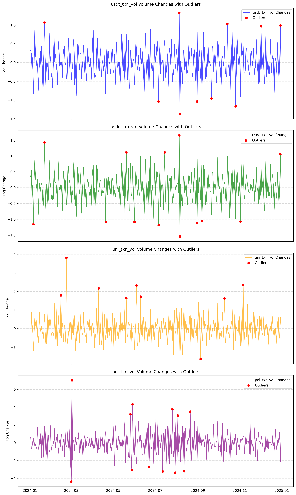
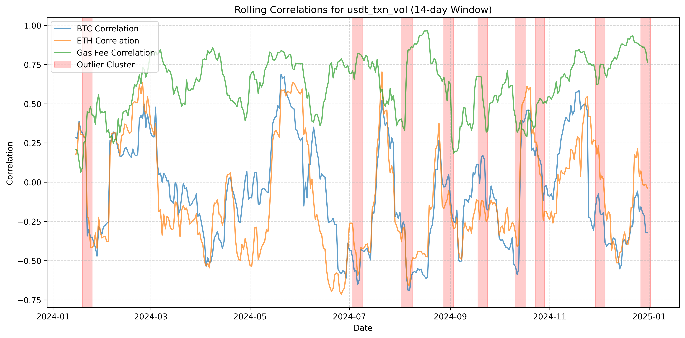
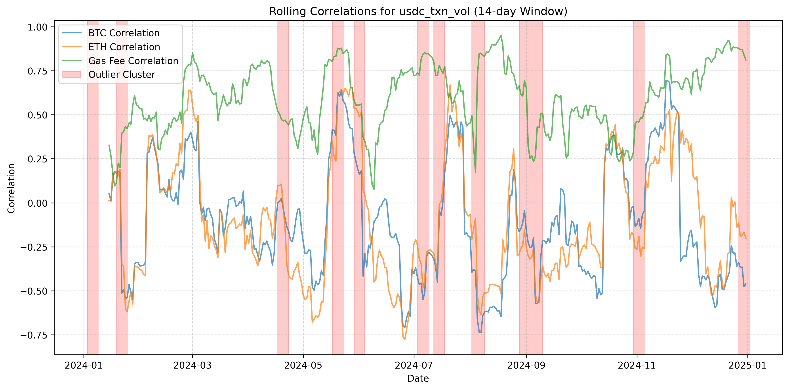
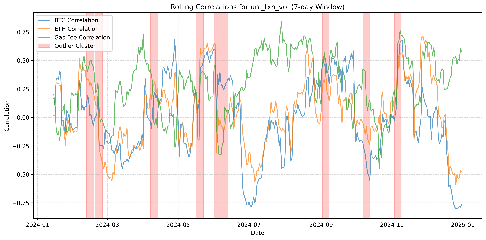
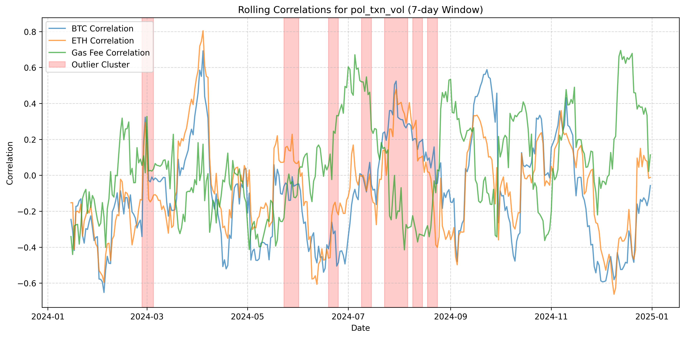

# DeFi Transaction Volume Analysis

## Introduction

This project analyzes daily transaction volumes of selected DeFi-related ERC-20 tokens (USDT, USDC, UNI, and POL) traded on decentralized exchanges (DEXs). The analysis incorporates on-chain data sourced via Dune queries and external off-chain data (e.g., BTC and ETH prices, Ethereum gas fees) to identify and analyze significant transaction volume changes in 2024. The goal is to provide insights into token behavior, correlations with external metrics, and patterns around outlier events.

## Set Up

### 1. Environment & Dependencies
1. **Set Up Conda Environment**:  
   Create and activate the Conda environment using the following commands:  
   ```bash
   conda create --name defi_analysis python=3.10
   conda activate defi_analysis
   pip install -r requirements.txt

### 2. Data Fetch
1. **Run `load_data.py` to Download Data**:  
   The script fetches on-chain transaction volumes for selected tokens and Ethereum gas fees using the Dune API. To run this script:
   - Obtain a Dune API key from [Dune's API Page](https://dune.com/product/api).  
   - Create a `.env` file in the same directory as `load_data.py` with the following content:  
     ```
     DUNE_API_KEY="your-api-key"
     ```
   - Execute the script to download and save all necessary data in the `data/on-chain/` folder:  
     ```bash
     python load_data.py
     ```

2. **External Data (Off-Chain)**:  
   The script also fetches BTC and ETH prices via Yahoo Finance. Data will be saved in the `data/off-chain/` folder.

3. **Pre-Downloaded Data**:  
   If preferred, use the pre-downloaded CSV files already included in the repository's `data/` folder.

## Analysis

### 1. Data Scope
   - Focused on DEX trades (e.g., swaps on Uniswap, PancakeSwap, Curve, etc.) as they represent core on-chain activity relevant for assessing decentralized transaction patterns.
   - Excludes centralized exchange (CEX) data for simplicity and scope alignment.
   - Daily transaction volumes from 2024 are used as a key metric for analyzing token activity trends.

---

### 2. Data Visualization

#### Daily Total Transaction Volumes in 2024
USDT and USDC exhibit high and relatively stable transaction volumes throughout 2024, with similar patterns and spikes, indicating comparable usage trends. In contrast, UNI and POL show varying periods of higher and lower transaction activity, reflecting more distinct and project-specific dynamics.



#### Market Share by DEX
Uniswap dominates the transaction volumes across all tokens, accounting for over 60% in USDT and USDC, and over 70% in POL, demonstrating its leading role among decentralized exchanges.



---

### 3. Time Series Analysis

#### Descriptive Statistics and Boxplots
Log changes were calculated to normalize the data and reduce skewness.
USDT and USDC have narrower interquartile ranges (IQRs) compared to UNI and POL, reflecting their more stable transaction activity, while UNI and POL show wider IQRs and more outliers, suggesting higher variability in their transaction volumes.



#### Normality Tests
Shapiro-Wilk and Kolmogorov-Smirnov applied to assess normality of distribution.

The distributions of log changes for USDT, USDC, UNI, and POL are skewed and exhibit heavy tails, indicating non-normal behavior consistent with highly volatile transaction patterns in decentralized exchanges



### Statistical Test Results

| Token        | Shapiro-Wilk (p-value) | Kolmogorov-Smirnov (p-value) | Conclusion                    |
|--------------|-------------------------|------------------------------|-------------------------------|
| **USDT**     | 0.9956 (0.3875)        | 0.2144 (0.0000)              | Mixed results, likely non-normal |
| **USDC**     | 0.9921 (0.0488)        | 0.1842 (0.0000)              | Not normally distributed      |
| **UNI**      | 0.9595 (0.0000)        | 0.1258 (0.0000)              | Not normally distributed      |
| **POL**      | 0.9707 (0.0000)        | 0.0468 (0.3880)              | Mixed results, likely non-normal |


#### Anomaly Detection
Based on the statistical test, the **Interquartile Range (IQR)** method was chosen to flag significant anomalies. 
- **Benefits**: IQR aligns with the skewed nature of the data, making it effective for flagging significant anomalies. The IQR method also offers simplicity and effectiveness.
- **Limitations**: But, it does not account for temporal trends or seasonality, which may lead to misinterpreting random noise as meaningful anomalies.

**Results**:
  - USDT: 10 outliers
  - USDC: 13 outliers
  - UNI: 9 outliers
  - POL: 12 outliers

1. **USDT**: Log changes display relatively stable patterns with occasional outliers, notably on shared dates with USDC (e.g., August 5th and 6th, 2024), indicating potential synchronized market events.

2. **USDC**: Similar to USDT, USDC exhibits aligned significant changes on key dates.

3. **UNI**: More volatile than stablecoins, UNI shows distinct outliers, especially in first half of 2024, suggesting protocol-specific activity driving unique transaction patterns.

4. **POL**: POL's log changes are sporadic, with extreme outliers (e.g., March 2024), highlighting low transaction volume and higher sensitivity to individual transactions.

These observations emphasize the shared patterns among stablecoins and protocol-specific dynamics like in UNI and POL.



---

### 4. Correlation Analysis

#### 1. External Data Used for Comparison
- **BTC and ETH Prices**: Reflect market sentiment and potential influence on DEX transactin volumes.
- **Ethereum Gas Fees**: Reflect network congestion and costs on the Ethereum blockchain.

Log changes (i.e., returns for BTC and ETH prices) were used to standardize the scale and allow meaningful comparisons across metrics.

#### 2. Rolling Correlation
Rolling correlations provide insights into dynamic relationships between token transaction volumes and external metrics over time. The analysis uses a 14-day rolling window during 2024 to capture these temporal dynamics. To enhance the analysis of significant volume changes, a 1-day buffer was applied to merge closely occurring outlier days into clusters. This approach ensures that periods of heightened activity or anomalies are analyzed as cohesive intervals rather than isolated events. 

- #### USDT:
    - Rolling correlations with BTC and ETH prices show fluctuating trends, with significant changes aligning with outlier clusters (e.g., in the September period).
    - Correlation with gas fees remains relatively higher and stable.
    

- #### USDC:
    - Similar to USDT, rolling correlations with BTC and ETH exhibit volatility, particularly during outlier periods in mid of 2024 (May - September).
    - Gas fee correlations demonstrate consistent positive trends, reflecting its sensitivity to on-chain activity costs and generally important in high-transfered tokens, such as stablecoins (applies also to USDT).
    

- #### UNI:
    - UNI shows less stable correlations with BTC and ETH prices compared to stablecoins, but align with sharp increase and decrease in June and the outlier detected between September and November.
    - Correlation with gas fees indicates a strong link during high on-chain activity periods (e.g., around May and November 2024).
    
- #### POL:
    - POL demonstrates weak and inconsistent correlations with BTC and ETH price changes, often diverging during outlier periods.
    - Gas fee correlation spikes are observed during certain outlier clusters, likely reflecting network-specific events or congestion impacts (especially in August 2024).
    

## Conclusion

This analysis successfully compiled and analyzed time-series data of transaction volumes for Tether (USDT), USDC, UNI, and POL tokens on Ethereum. Using on-chain data from Dune and off-chain metrics like BTC/ETH prices and Ethereum gas fees, this analysis identified significant volume changes and their potential relationship with external factors.

Stablecoins (USDT and USDC) showed consistent patterns and similar significant changes, reflecting their central role in DeFi. UNI and POL exhibited distinct behaviors, potentially tied to protocol-specific dynamics. The analysis also highlighted the influence of gas fees on transaction activity, particularly for stablecoins.

### Key Takeaways
1. **Significant Changes Identified**: IQR-based anomaly detection flagged critical dates, including shared anomalies for USDT and USDC (e.g., August 5-6, 2024).
2. **Correlation Behavior**: Rolling correlations revealed shifting relationships between transaction volumes and external metrics, with stablecoins showing sensitivity to gas fees and UNI/POL reflecting their unique roles.
3. **DeFi Activity**: The analysis emphasized stablecoins' consistent patterns and identified periods of increased activity linked to broader market trends.

### Limitations
- The analysis focused only on DEX trades (swaps) and single-chain activity, limiting the scope to Ethereum.
- Simplified methods like IQR and rolling correlations do not capture complex causal dynamics.
- External factors such as trading volumes from centralized exchanges (CEX) or macroeconomic indicators were not included.

### Next Steps
1. Expand the scope to include CEX trading volumes and multi-chain activity for a more comprehensive market view.
2. Apply advanced statistical or machine learning methods for deeper causal analysis of significant volume changes.
3. Incorporate additional external and contextual data, such as protocol-specific or political or economic events (e.g., crypto ETF launches), to enhance explanatory power.